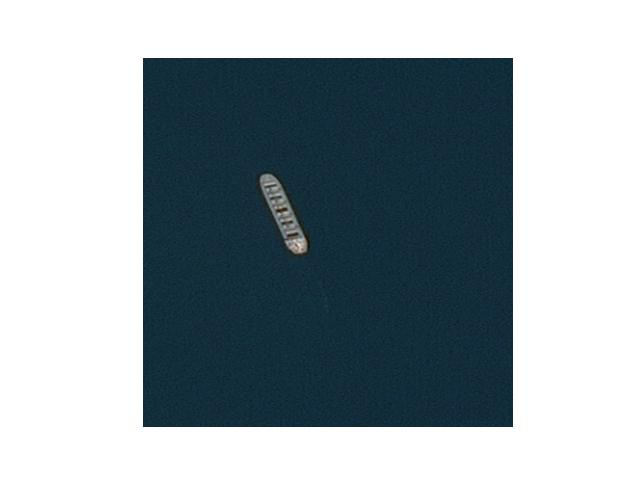
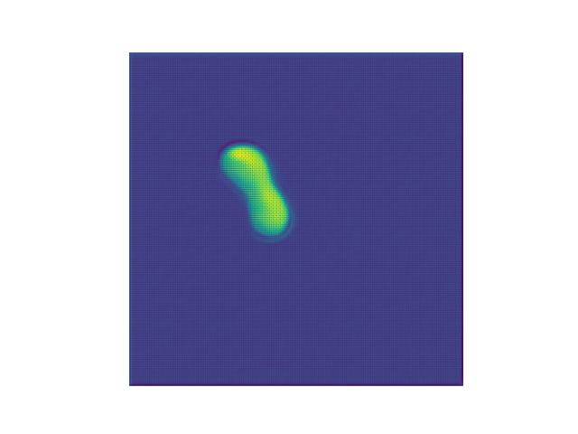

# Airbus Ship Detection Challenge Solution

[](https://www.kaggle.com/c/airbus-ship-detection)
[](https://opensource.org/licenses/MIT)

## Description

This repository contains the solution for the Airbus Ship Detection Challenge on Kaggle. The challenge involves detecting and classifying ships in satellite images. The solution is based on the U-Net architecture with an encoder using transfer learning from VGG16 or ResNet50V2.

The model architecture leverages the power of pre-trained convolutional neural networks to enhance ship detection performance in satellite imagery.

+ [U-net Paper](https://arxiv.org/abs/1505.04597)
+ [Kaggle Notebook for EDA](https://www.kaggle.com/sidelmeril/airbus-ship-detection)

Results of training on small subset (32x10, 32x2):

| Sample | Prediction |
|--------|------------|
|  |  |

## Table of Contents

- [Installation](#installation)
- [Training](#training)
- [Usage](#usage)

## Installation

1. Download project

Git installation

```bash
sudo apt install git-all
```

Cloning of repo
```bash
git clone -b main https://github.com/sidelmeril/airbus_detection_kaggle.git
```

Move to cloned repo
```bash
cd airbus_detection_kaggle
```

2. Install requirements
```bash
pyhton3 -m pip install -r requirements.txt --ignore-installed
```

## Training

To train the model, you can use the following script:

```bash
python train.py
```

Feel free to adjust [config file](config.py) for your purposes. 

## Usage

To perform inference with the trained model, you can use the following script:

```bash
python inference.py --image_path path/to/your/image.jpg --output_path path/to/save/predictions.jpg
```